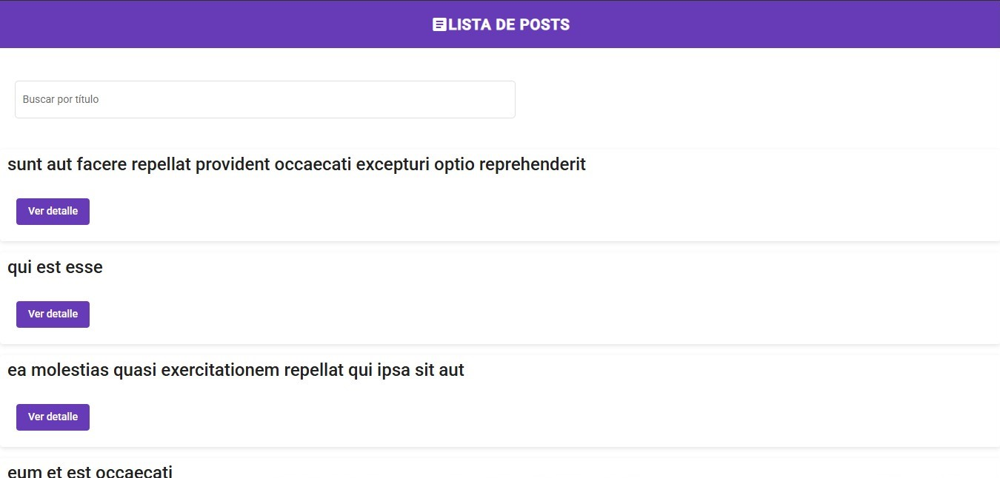
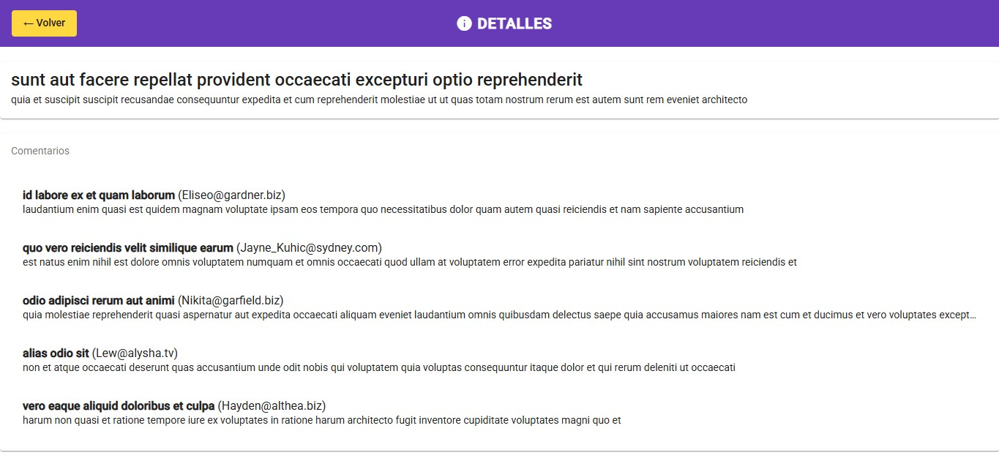

# 📘 Desafío Técnico Angular Jr – FOCA Software

Este proyecto es una aplicación web desarrollada con **Angular 14**, como parte del desafío técnico para el puesto de **Desarrollador Angular Jr** en FOCA Software.  
La app permite consultar una lista de publicaciones y ver su detalle, utilizando datos reales simulados desde `jsonplaceholder.typicode.com`.

---
# Sitio publicado
[desafio-tecnico-foca.netlify.app](https://desafio-tecnico-foca.netlify.app/posts)

## 🛠️ Tecnologías utilizadas

- Angular 14
- Angular Material
- RxJS
- TypeScript
- HTML / SCSS
- Jasmine & Karma (para tests unitarios)

---

## 🎯 Funcionalidades implementadas

✔️ Listado de posts desde API  
✔️ Búsqueda en tiempo real por título (Pipe personalizado)  
✔️ Vista de detalle con contenido y comentarios  
✔️ Manejo de errores y carga (spinner)  
✔️ Estilo moderno con Angular Material  
✔️ Botón de volver en barra superior  
✔️ Pruebas unitarias completas en servicios y componentes

---

## 🧪 Tests ejecutados

```bash
ng test
```

Todos los tests fueron desarrollados con Jasmine y Karma, incluyendo:

✅ PostService (3 métodos probados: getPosts, getPostById, getCommentsByPostId)

✅ PostListComponent (render de título y posts)

✅ PostDetailComponent (render dinámico con ActivatedRoute)

✅ SpinnerComponent y Pipe personalizada

## ⚠️ Nota sobre configuración de Karma

Este proyecto tiene una modificación en ```karma.conf.js``` para ejecutar los tests en Brave en lugar de Chrome:

```ts
process.env.CHROME_BIN = 'C:\\Program Files\\BraveSoftware\\Brave-Browser\\Application\\brave.exe';
```

- 🧠 Si ya tenés Brave instalado, podés dejarlo tal como está.
- ❌ Si no usás Brave, simplemente eliminá esa línea para que Karma abra el navegador por defecto (Chrome o Firefox).

## ▶️ Cómo correr la app localmente

1. Clonar el repositorio
```bash
git clone https://github.com/Monteluca/desafio-angular-jr.git
```

2. Instalar dependencias
```bash
npm install
```
3. Correr el servidor
```bash
ng serve
```
4. Abrir en el navegador
```bash
http://localhost:4200
```


## 📸 Capturas

### 🔹 Vista principal


### 🔹 Vista de detalles


## 📩 Autor

**Desarrollado por Luca Monteleone**

- 💼 Full Stack Developer – Angular & Spring  
- 📫 [lucamonteleone546@gmail.com](mailto:lucamonteleone546@gmail.com)  
- 🌐 [GitHub: Monteluca](https://github.com/Monteluca)

